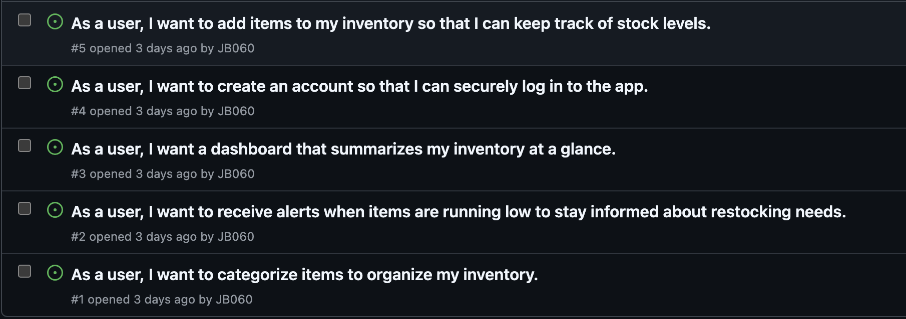
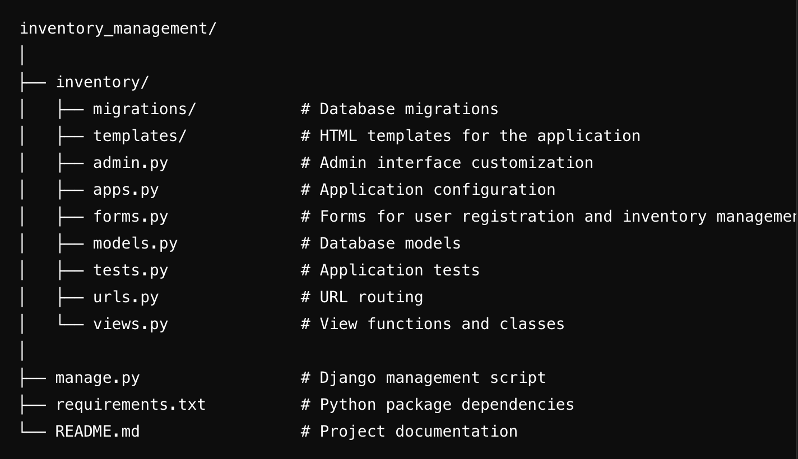
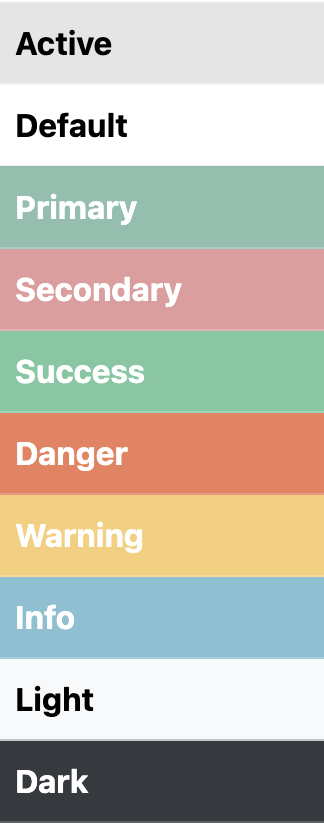
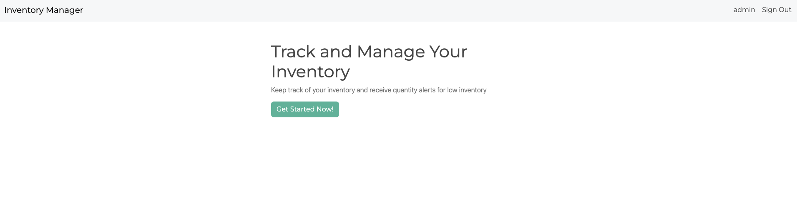
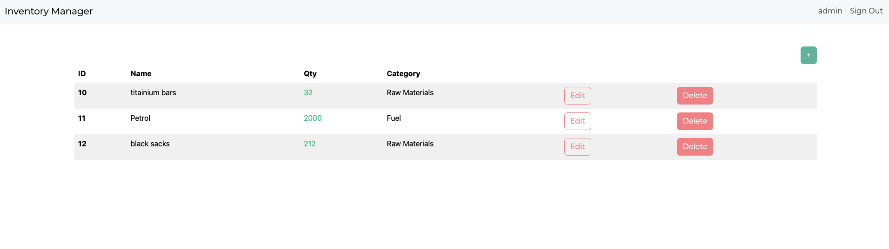
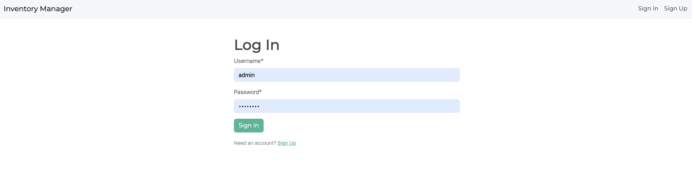
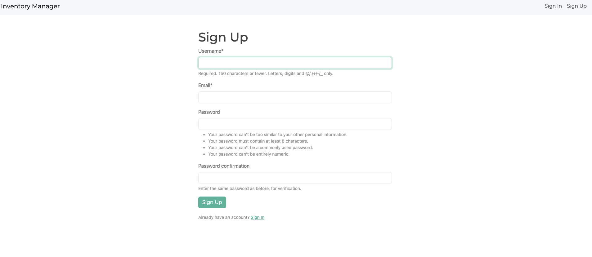
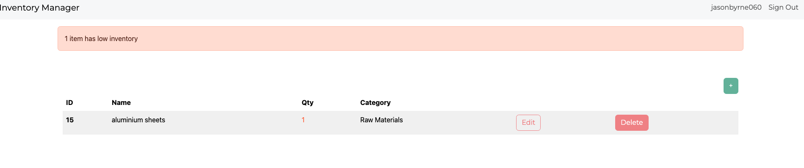
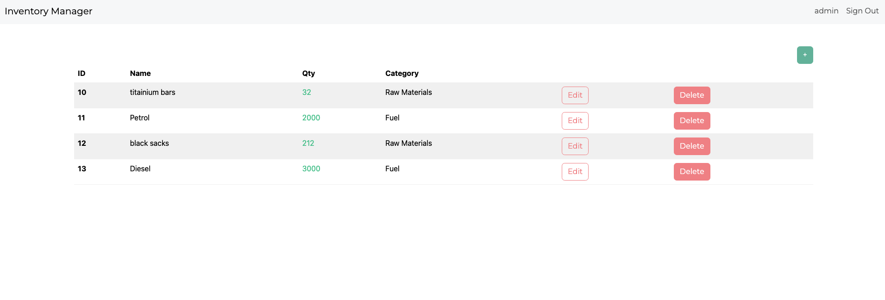
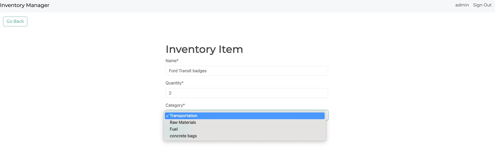

# Inventory Management System

A Django-based web application to manage and track inventory items, organize them by categories, and receive alerts for low stock levels. This system allows users to register, authenticate, and access a personalized dashboard for efficient inventory management.

---

## Table of Contents

1. [User Experience (UX)](#user-experience-ux)  
   - [Strategy](#strategy)  
   - [Scope](#scope)  
   - [Structure](#structure)  
   - [Skeleton](#skeleton)  
   - [Surface](#surface)  
2. [Features](#features)  
   - [General](#general)  
   - [Home Page](#home-page)  
   - [Dashboard](#dashboard)  
   - [Authentication Pages](#authentication-pages)  
   - [Item Management Pages](#item-management-pages)  
   - [Additional Features](#additional-features)  
3. [Future Features](#future-features)  
4. [Technologies Used](#technologies-used)  
   - [Languages Used](#languages-used)  
   - [Libraries and Frameworks](#libraries-and-frameworks)  
   - [Packages / Dependencies Installed](#packages--dependencies-installed)  
   - [Database Management](#database-management)  
   - [Tools and Programs](#tools-and-programs)  
5. [Testing](#testing)  
   - [Manual Testing](#manual-testing)  
   - [Automated Testing](#automated-testing)  
6. [Deployment](#deployment)  
   - [Steps to Deploy on Heroku](#steps-to-deploy-on-heroku)  
   - [Finished Product](#finished-product)  

---

## User Experience (UX)

### Strategy

#### Project Goals
- Develop a user-friendly inventory management application for personal or small business use.
- Allow users to easily track inventory levels, organize items by category, and receive low-inventory alerts.

#### User Goals
- **Effortless item tracking**: Users should be able to add, edit, delete, and view items in their inventory.
- **Category organization**: Users can categorize items for easier navigation and organization.
- **Low inventory alerts**: Users receive warnings when items run low to facilitate timely restocking.

#### Strategy Table

| Feature                | Importance | Viability |
|------------------------|------------|-----------|
| User authentication    | High       | High      |
| Item CRUD operations   | High       | High      |
| Low inventory alerts   | High       | High      |
| Category management    | Medium     | High      |
| Responsive design      | High       | High      |

---

### Scope

#### User Stories

1. As a user, I want to create an account so that I can securely log in to the app.
2. As a user, I want to add items to my inventory so that I can keep track of stock levels.
3. As a user, I want to categorize items to organize my inventory.
4. As a user, I want to receive alerts when items are running low to stay informed about restocking needs.
5. As a user, I want a dashboard that summarizes my inventory at a glance.

---

### Structure

- **Navigation**: Simple navigation with links to key features (dashboard, add item, sign in/out).
- **CRUD Operations**: Comprehensive item management options, including add, edit, delete, and view.
- **User Authentication**: Secure access to manage inventory.  

---

### Skeleton

- **Home Page**: Welcomes users and prompts them to log in or sign up.
- **Dashboard**: Main inventory management interface with a table of items.
- **Inventory Forms**: Forms for adding, editing, and deleting items.
- **Authentication Pages**: Separate pages for login, logout, and signup.

---

### Wireframes
- **Home Page**: Welcomes users and prompts them to log in or sign up.
  

---

### Surface

- **Color Scheme**: Uses Bootstrap Minty theme for a clean, user-friendly interface.  

- **Typography**: Readable and accessible fonts for a professional look.
- **Layout**: Responsive layout using Bootstrap grid, optimized for desktop and mobile.

---

## Features

### General
- **Responsive Design**: Accessible on all devices with a clean, minimalistic interface.
- **Error Messages**: Provides visual feedback for successful actions and alerts for low inventory.

### Home Page
- Introduces the app and allows users to log in or sign up.  

### Dashboard
- Displays an organized view of all inventory items.
- Allows for easy access to add, edit, or delete items.  

### Authentication Pages
- **Login**: Authenticates existing users.
- **Signup**: Allows new users to register.
- **Logout**: Provides an option for users to log out securely.  
  
  
- New User added to the system.  

### Item Management Pages
- **Add Item**: Form to add a new item to the inventory.  
  

- **Edit Item**: Allows users to update item information.  

- **Delete Item**: Removes an item from the inventory.  

- **Low Inventory Item**: Shows items with low inventory and gives a warning:  

---

## Future Features

To enhance the application's functionality and user experience, the following features are planned for future implementation:

1. **Inventory Notifications**:
   - Real-time email or SMS notifications for low-stock or out-of-stock items.
   - Periodic reports summarizing inventory levels and critical items.

2. **Role-Based Access Control**:
   - Introduce user roles such as admin, manager, and staff.
   - Provide role-specific access to certain features and data.

3. **Inventory Import/Export**:
   - Allow users to bulk import items via Excel or CSV files.
   - Enable exporting detailed inventory reports in PDF and CSV formats.

4. **Barcode Scanning Integration**:
   - Implement barcode scanning for faster inventory management.
   - Generate printable barcodes for items.

5. **Audit Logs**:
   - Track and display a history of changes made to inventory items for accountability.

6. **Multi-Warehouse Support**:
   - Manage inventory across multiple warehouses or locations.
   - Include stock transfer functionality between locations.

7. **Analytics Dashboard**:
   - Add visualizations like graphs and charts to display stock trends, top-selling items, and restocking needs.

8. **API Integration**:
   - Provide an API to allow third-party systems to interact with the inventory management application.

9. **Mobile App Support**:
   - Develop a mobile-friendly version or standalone app for Android and iOS.

10. **Dark Mode**:
    - Offer a dark mode for improved user experience and accessibility.
   
---

## Technologies Used

### Languages Used
- **HTML5**: Structure and layout of pages.
- **CSS3**: Styling with Bootstrap framework.
- **Python**: Core application logic with Django framework.

### Libraries and Frameworks
- **Django**: Backend web framework for app functionality.
- **Bootstrap**: Frontend framework for styling and responsive design.
- **Crispy Forms**: For rendering Django forms with Bootstrap styling.

### Packages / Dependencies Installed
- **Django**: Main web framework.
- **Crispy Forms**: Enhances form styling with Bootstrap.
- **Django Authentication**: Manages user authentication flows.

### Database Management
- **SQLite**: Local database for development.
- **PostgreSQL** (optional): For production deployments.

### Tools and Programs
- **Visual Studio Code**: Development environment.
- **Git**: Version control.
- **Heroku**: For deployment.
- **Postman**: For testing API endpoints.
- **GitHub**: Version control and collaboration.

---

## Testing

### Manual Testing

Each feature was manually tested by simulating user interactions, including:
1. **User Authentication**: Verified sign-up, login, and logout functionalities.
2. **Inventory CRUD Operations**: Tested adding, editing, deleting, and viewing inventory items.
3. **Low Inventory Alerts**: Confirmed alerts display for items at or below the minimum threshold.
4. **Responsive Design**: Verified the application's compatibility across various screen sizes (desktop, tablet, and mobile).
5. **Error Handling**: Checked for error messages in case of incorrect inputs (e.g., empty fields).

### Automated Testing

Automated tests were written for critical components:
- **Models**: Validated data integrity and relationships, such as items linked to specific categories.
- **Views**: Ensured views return the correct data and templates based on user permissions.
- **Forms**: Tested form validation and field requirements.

---

## Deployment

### Steps to Deploy on Heroku

1. Create a Heroku account and install Heroku CLI.
2. Clone this repository and navigate to the project folder.
3. Run `heroku create` to create a new Heroku app.
4. Push the project to Heroku with `git push heroku main`.
5. Set environment variables and configure the database on Heroku.
6. Run `heroku run python manage.py migrate` to set up the database.

---

### Finished Product

Once deployed, access the live application to manage inventory items efficiently.

